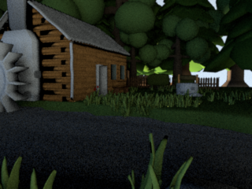
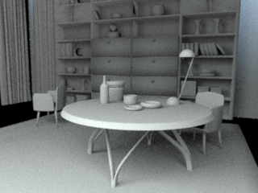
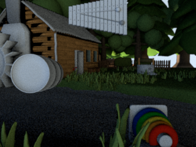
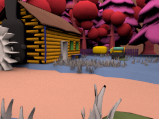
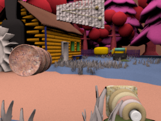
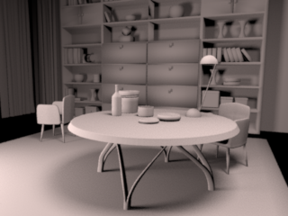
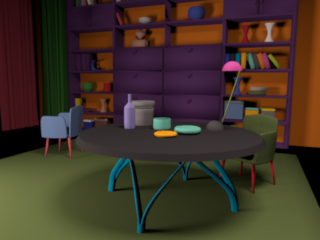
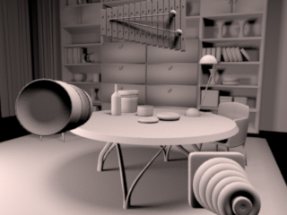
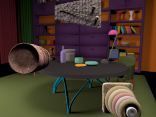

# VirtualScenesEngine
Leverage [VirtualScenesAssets](https://github.com/RenderToolbox/VirtualScenesAssets) into myriad scenes that we can render and analyze.

# Overview
The goal of VirtualScenesEngine is to leverage our [VirtualScenesAssets](https://github.com/RenderToolbox/VirtualScenesAssets) into myriad virtual scenes that we can manipulate, render, and analyze.

# 3D Models
One way that VirtualScenesEngine leverages assets is by re-combining multiple 3D models into new scenes.

We can load 3D models using [mexximp](https://github.com/RenderToolbox/mexximp).  This helps us get the 3D models into Matlab memory where we can interrogate and manipulate them.  mexximp also helps us add things like lights and cameras if they are missing.

A [VseModel](api/VseModel.m) supplements each mexximp model with additional data, like:
 - a name
 - a spatial transformation to apply to the model

Here are some examples of re-combining models.  Each starts with an "outer" model, either a Mill or a Library.  For each outer model, we insert a set of "inner" models, in this case either the empty set {} or a set of three objects.

Since the two outer models are created separately from the two sets of inner models, we can form all of the 2x2 combinations.  In the table below, the colums show the two outer models and the rows show the two sets of inner models.

| | Mill | Library |
| ------------- | ------------- | ------------- |
| {} |  |  |
| {Barrel, RingToy, Xylophone} |  |  

Note that the inner objects occupy the same positions in the image, in both the Mill and the Library.  This is because the inner objects were inserted relative to the camera in each scene.  This is a [convenience option](examples/vseProofOfConept.m#L30) and not required.

Forming combinations like this should work in general, not only for this 2x2 example.

# Styles
Another way that VirtualScenesEngine leverages assets is by re-combining models with "Styles".

VirtualScenesEngine adds the concept of a "Style" which is independent of any 3D model.  Each [VseStyle](api/VseStyle.m) includes things like:
 - criteria for selecting models by name, and whether they were used as outer or inner, as above
 - criteria for selecting model elements by name and type
 - custom methods for manipulating model elements 

Any style can be applied to any given model.  The VirtualScenesEngine takes care of selecting models and model elements, and passing the selected elements to a method that you write.  Your method can then make arbitrary changes to those elements.

Here are some more examples.  Each starts with one of the models produced above.  For each model, one of two styles is applied: either a "plain" style which is spectrally uniform, or a "colorsAndTextures" style in which colors in the base scene use reflectances from the [ColorChecker](https://en.wikipedia.org/wiki/ColorChecker) chart, and colors in the inserted objects use [various image textures](https://github.com/RenderToolbox/VirtualScenesAssets/tree/master/examples/Textures/OpenGameArt).

Since the four models are created separately from the two styles, we can form all of the 4x2 combinations.  In the table below, the columns show the two styles and the rows show the four combinations of models from above.

| | plain | colorsAndTextures |
| ------------- | ------------- | ------------- |
| Mill + {} |  |  |
| Mill + {Barrel, RingToy, Xylophone} |  |  |
| Library + {} |  |  |
| Library + {Barrel, RingToy, Xylophone} |  |  |

Again, forming combinations like this should work in general, not only for this 4x2 example.

# Render Toolbox
VirtualScenesEngine is intended to work with [RenderToolbox4](https://github.com/RenderToolbox/RenderToolbox4).  3D models are loaded using Assimp and mexximp, which RenderToolbox4 supports.  Models and styles can be combined with RenderToolbox "hints", to produce complete, stand-alone RenderToolbox rendering recipes.

The scenes above were created with VirtualScenesEngine and saved as RenderToolbox recipes.  They were rendered with RenderToolbox4 and [Mitsuba](http://www.mitsuba-renderer.org/).  The code is included in this repository as the [proof of concept example](examples/vseProofOfConept.m).

