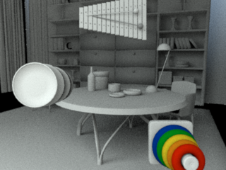
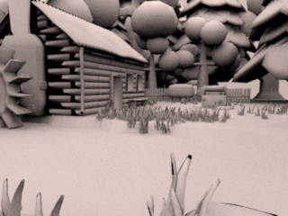
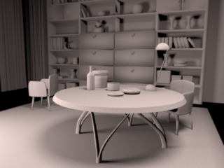
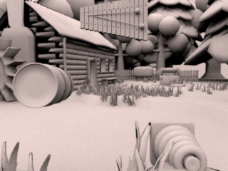
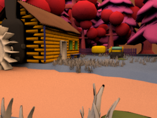
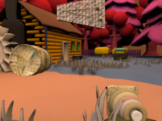
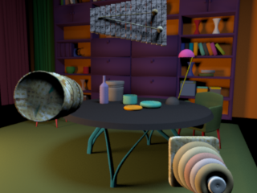

# VirtualScenesEngine
Leverage [VirtualScenesAssets](https://github.com/RenderToolbox/VirtualScenesAssets) into myriad scenes that we can render and analyze.

This is a work in progress.  For now, here are some docks and images based on a [proof of concept example](https://github.com/RenderToolbox/VirtualScenesEngine/blob/master/examples/poc.m).

# Overview

The goal of VirtualScenesEngine is to leverage our [VirtualScenesAssets](https://github.com/RenderToolbox/VirtualScenesAssets) into myriad virtual scenes that we can manipulate, render, and analyze.

# 3D Models
We can load 3D models using [mexximp](https://github.com/RenderToolbox/mexximp).  This helps us get the 3D models into Matlab memory where we can interrogate and manipulate them.  mexximp also helps us add things like lights and cameras if they are missing.

A [VseModel](https://github.com/RenderToolbox/VirtualScenesEngine/blob/master/api/VseModel.m) supplements each mexximp model with additional data, like:
 - a name
 - a spatial transformation to apply to the model
 - a selector for meshes that should be "blessed" or "lit up" as area lights

One way that VirtualScenesEngine leverages assets is by re-combining multiple VseModels into new scenes.

Here are some examples.  Each starts with an "outer" model, either a Mill or a Library.  For each outer model, we insert a set of "inner" models, in this case either the empty set {} or a set of three objects.

Since the two outer models are created separately from the two sets of inner models, we can form all of the 2x2 combinations.

| "Inner" Model Set | Mill | Library |
| ------------- | ------------- | ------------- |
| {} |  |  |
| {Barrel, RingToy, Xylophone} |  |  

Forming combinations like this should work in general, not only for this 2x2 example.

# Styles
VirtualScenesEngine adds the concept of a "Style" which is independent of any 3D model.  Each [VseStyle](https://github.com/RenderToolbox/VirtualScenesEngine/blob/master/api/VseStyle.m) includes things like:
 - material definitions and reflectance spectra
 - illuminant spectra
 - renderer configurations, which are often tightly coupled to materials and lighting

Any style can be applied to any given model: the style's materials and illuminants are cycled over the corresponding elements in the model.  The intuition is similar to that of a [Matlab colormap](https://www.mathworks.com/help/matlab/ref/colormap.html#buq1hym), where an arbitrary set of colors (like a style) can be applied to the lines and patches of any plot (like model).

This cycling approach should support full control over style values that are assigned to model elements: as long as the numbers match, the assignments will go one-to-one.  It should also support concise and reusable style definitions based on one or a few values.

Another way that VirtualScenesEngine leverages assets is by re-combining models and styles.

Here are some more examples.  Each starts with one of the models produced above.  For each model, one of two styles is applied: either a Plain style which is spectrally uniform, or a ColorChecker/Texture style in which colors in the base scene use reflectances from the [ColorChecker](https://en.wikipedia.org/wiki/ColorChecker) chart, and colors in the inserted objects use [various image textures](https://github.com/RenderToolbox/VirtualScenesAssets/tree/master/examples/Textures/OpenGameArt).

Since the four models are created separately from the two styles, we can form all of the 4x2 combinations.

| Style | Mill | Library |
| ------------- | ------------- | ------------- |
| Plain |  |  |
| Plain |  |  |
| ColorChecker/Texture |  |  |
| ColorChecker/Texture |  |  |

Again, forming combinations like this should work in general, not only for this 4x2 example.

# Render Toolbox
VirtualScenesEngine is intended to work with [RenderToolbox4](https://github.com/RenderToolbox/RenderToolbox4).  3D models are loaded using Assimp and mexximp, which RenderToolbox4 supports.  Styles are expressed and applied programmatically to scenes using the [VseMapping](https://github.com/RenderToolbox/VirtualScenesEngine/blob/master/api/VseMapping.m) which are a utility for constructing [RenderToolbox4 Mappings](https://github.com/RenderToolbox/RenderToolbox4/wiki/Mappings-File-Format).  Models and styles can be combined with RenderToolbox "hints", to produce complete, stand-alone RenderToolbox rendering recipes.
